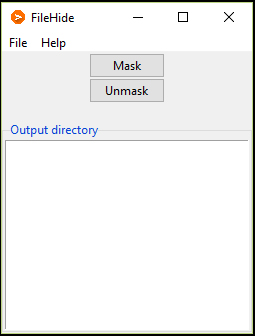
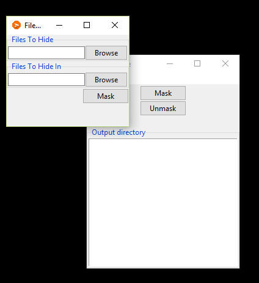
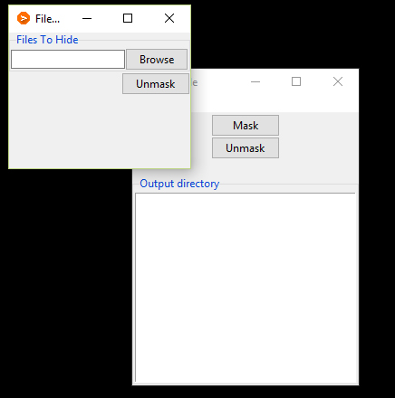

# FileHide
A cross platform GUI application which hides a file in another file,keeping host working as normal.
This application hides given files like pdf,images ,videos etc into another file like pdf,images etc.
This app can also hide multiple files into a file.
(The files should not excede 1GB in size)
### Prerequisities
* Python 2.7.x
* Tkinter module.
```
apt-get install python-tk
```
### Screenshots





## License
This project is licensed under the MIT License - see the [LICENSE.txt](LICENSE.txt) file for details
